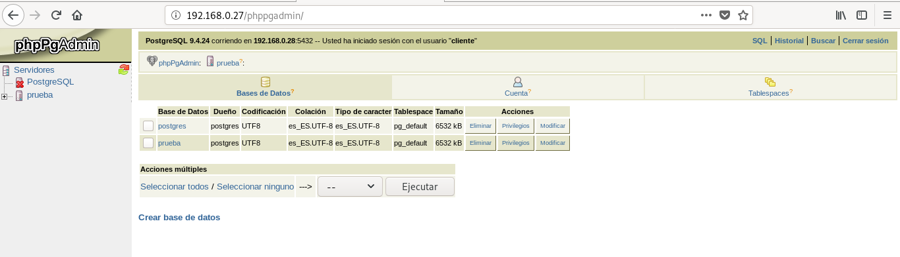

# Instalación de una herramienta de administración web para PostgreSQL
La herramienta de administración que se va a instalar es **phppgadmin** que realiza la conexión entre Php5 y PostgreSQL.

### Instalación y configuración
Se necesita instalar los paquetes **phppgadmin** y **php5-pgsql**.
~~~
apt-get install phppgadmin php5-pgsql
~~~

Se edita el fichero de configuración de apache que define las configuraciones, el cual se encuentra en la ruta **/etc/apache2/conf-available/phppgadmin.conf** y, en él, se comenta la línea **Require local**.

También hay que modificar el fichero de configuración general de phppgadmin ubicado en **/etc/phppgadmin/config.inc.php** y modificar el siguiente parámetro true por false:
~~~
$conf[‘extra_login_security’] = true
~~~

En este mismo fichero se añaden las siguiente líneas indicando la IP y el puerto del servidor:
~~~
$conf['servers'][1]['host'] = '172.22.9.121';
$conf['servers'][1]['port'] = 5432;
~~~

Se reinicia el servidor apache:
~~~
/etc/init.d/apache2 restart
~~~

### Comprobación de funcionamiento
Mediante un navegador web, accedemos a la dirección http://{IP del servidor}/phppgadmin/ donde aparecerá una pantalla de bienvenida con información sobre la versión instalada, el idioma y el tema utilizado entre otro tipo de información.

También aparecen los servidores con los que tiene conexión y, tras loguearse en uno de ellos, la información que contiene:
